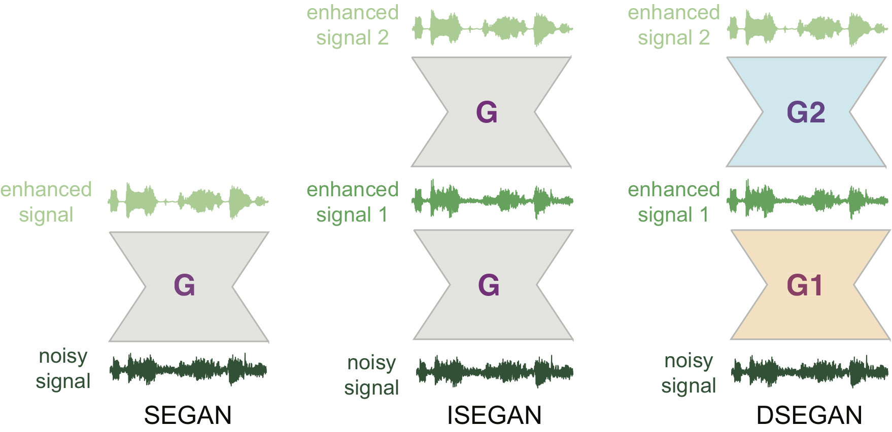
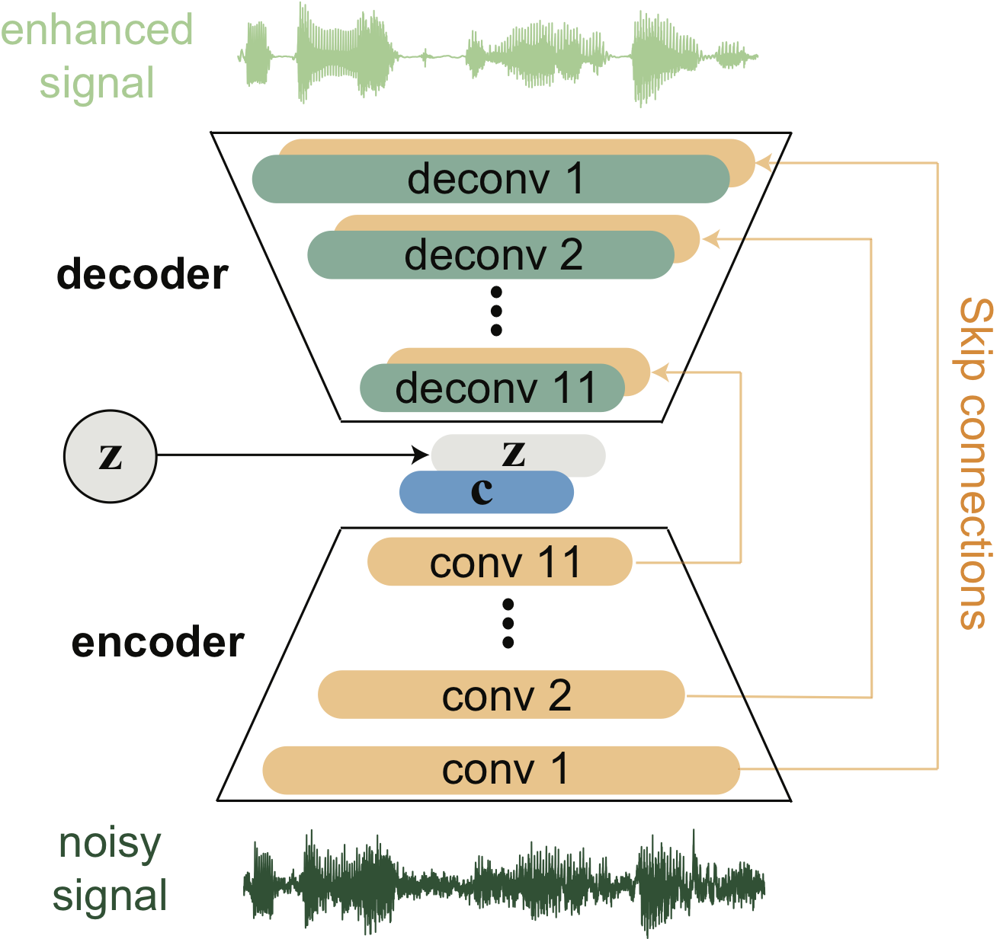
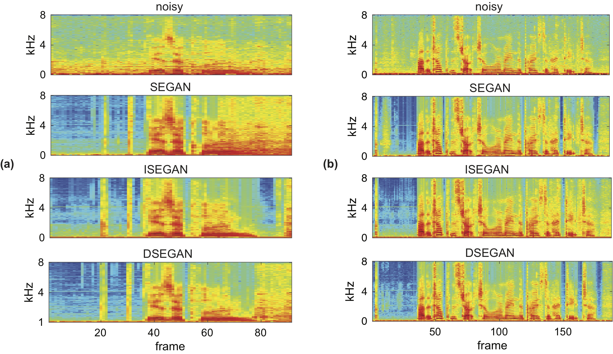

## Improving GANs for Speech Enhancement


### Introduction

This is the repository of the DSEGAN, ISEGAN, (and the baseline SEGAN) in our original paper:

H. Phan, I. V. McLoughlin, L. Pham, O. Y. Chén, P. Koch, M. De Vos, and A. Mertins, "[_Improving GANs for Speech Enhancement_](https://arxiv.org/pdf/2001.05532.pdf)," arXiv preprint arXiv:2001.05532, 2020.

ISEGAN (Iterated SEGAN) and DSEGAN (Deep SEGAN) were built upon the SEGAN proposed by [Pascual _et al._](https://arxiv.org/abs/1703.09452) and SEGAN repository from [santi-pdp](https://github.com/santi-pdp/segan).

Different from SEGAN with a single generator, ISEGAN and DSEGAN have multiple generators which are chained to perform multi-stage enhancement mapping:

[//]: #


The enhacement result of one generator is supposed to be further enhanced/corrected by the next generator in the chain. DSEGAN's generators are independent while ISEGAN's generators share parameters. Similar to SEGAN, the generators are based on fully convolutional architecture and receive raw speech waveforms to accomplish speech enhancement:

[//]: #


**The project is developed with TensorFlow**. 
### Dependencies

* tensorflow_gpu 1.9
* numpy==1.1.3
* scipy==1.0.0

### Data

The speech enhancement dataset used in the work can be found in [Edinburgh DataShare](http://datashare.is.ed.ac.uk/handle/10283/1942). **The following script downloads and prepares the data for TensorFlow format**:

```
./download_audio.sh
./create_training_tfrecord.sh
```

Or alternatively download the dataset, convert the wav files to 16kHz sampling and set the `noisy` and `clean` training files paths in the config file `e2e_maker.cfg` in `cfg/`. Then run the script:

```
python make_tfrecords.py --force-gen --cfg cfg/e2e_maker.cfg
```

### Training

Once you have the TFRecords file created in `data/segan.tfrecords` you can simply run one of the following scripts.

```
# ISEGAN: run inside isegan directory
./run_isegan.sh
# DSEGAN: run inside dsegan directory
./run_dsegan.sh
# SEGAN baseline: run inside segan directory
./run_segan.sh
```
Each script consists of commands for training and testing with 5 different checkpoints of the trained model on the test audio files with. You can modify the bash script to customize parameters (e.g. which GPUs to use) and what you want to run.

Enhancement results on two different test files:

[//]: #


### Reference

```
@article{phan2019idsegan,
  title={Improving GANs for Speech Enhancement},
  author={Huy Phan, Ian V. McLoughlin, Lam Pham, Oliver Y. Ch\'en, Philipp Koch, Maarten De Vos, and Alfred Mertins},
  journal={arXiv preprint arXiv:2001.05532},
  year={2020}
}
```

### Contact

e-mail: h.phan@kent.ac.uk or huy.phan@ieee.org

### Further things to add

* <span style="color:red">_When I have some time, I will try to improve comments on the source code._</span>
* <span style="color:red">_The pretrained models will be uploaded separately._</span>
* <span style="color:red">_Some audio examples will be added for demonstration._</span>

### Notes

* If using this code, parts of it, or developments from it, please cite the above reference.
* We do not provide any support or assistance for the supplied code nor we offer any other compilation/variant of it.
* We assume no responsibility regarding the provided code.
